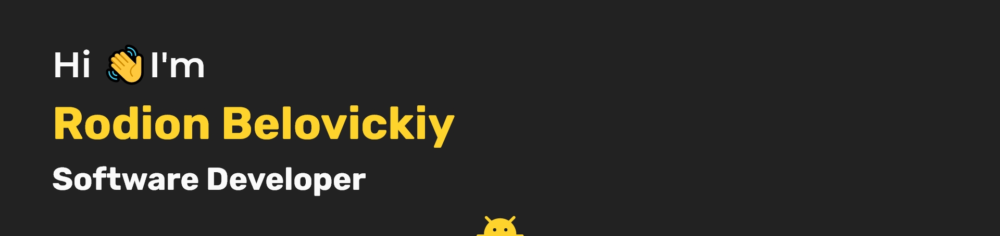

<!---
<h1 align="center">Hi 👋, I'm Rodion Belovitsky</h1>
-->

❤️ Programming | 💛 Kotlin | 🖤 Digital Art | 💙 TV series, films and anime 

- 💬 Ask me about anything. I will try to help you as much as I can.
- ⚡ Quote: `It's never too late to learn. In our time, you can learn everything.`
- 📫 How to reach me:

 

### Languages and technologies 

          

As well as many other languages and tools that I had experience with during my studies or in my free time

### Github stats

### My latest projects

#### Others

